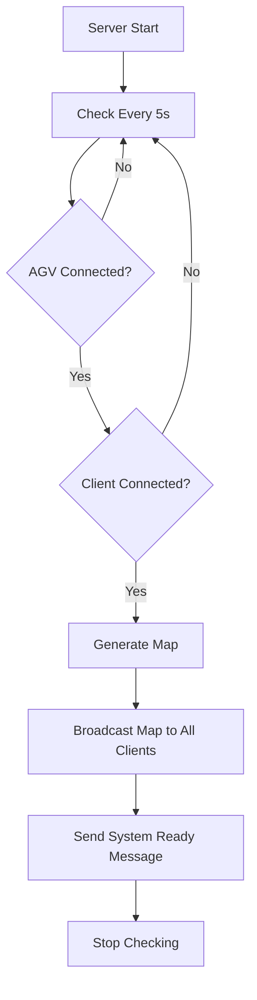

# 🗺️ Map Generation Feature

## Overview
가상 맵 생성 및 목표 지점 설정 기능을 추가했습니다. AGV와 프론트엔드가 모두 연결되면 자동으로 맵이 생성되며, 사용자가 목표 지점을 설정하면 AGV가 자동으로 이동합니다.

## Architecture

### 새로운 모델 (`models/map.go`)
```go
type MapGrid struct {
    ID        string
    Width     float64
    Height    float64
    CellSize  float64
    Obstacles []Obstacle
    Goals     []Goal
    StartPos  Position
    CreatedAt time.Time
}

type Obstacle struct {
    ID       string
    Position Position
    Radius   float64
    Type     string // "circle", "rectangle"
}

type Goal struct {
    ID       string
    Position Position
    Status   string // "pending", "active", "completed"
    Radius   float64
}
```

### Map Generator Service (`services/map_generator.go`)
- **랜덤 장애물 생성**: 맵 내에 5개의 랜덤 원형 장애물 배치
- **목표 지점 관리**: 목표 추가, 업데이트, 상태 변경
- **위치 유효성 검사**: 경계 및 장애물 충돌 체크
- **Thread-safe**: RWMutex를 사용한 동시성 제어

### WebSocket Messages

#### 1. Map Grid Message
```json
{
  "type": "map_grid",
  "data": {
    "map_id": "uuid",
    "width": 20.0,
    "height": 20.0,
    "cell_size": 0.5,
    "obstacles": [...],
    "goals": [...],
    "start_pos": {"x": 10, "y": 10, "z": 0}
  },
  "timestamp": 1234567890
}
```

#### 2. Goal Set Message
```json
{
  "type": "goal_set",
  "data": {
    "goal_id": "uuid",
    "position": {"x": 15.0, "y": 18.0, "z": 0},
    "radius": 0.5
  },
  "timestamp": 1234567890
}
```

#### 3. AGV Command Message
```json
{
  "type": "agv_command",
  "data": {
    "agv_id": "sion-001",
    "command": "move_to",
    "target_pos": {"x": 15.0, "y": 18.0, "z": 0},
    "timestamp": 1234567890
  },
  "timestamp": 1234567890
}
```

#### 4. System Ready Message
```json
{
  "type": "system_ready",
  "data": {
    "agv_count": 1,
    "client_count": 2,
    "map_generated": true
  },
  "timestamp": 1234567890
}
```

## REST API Endpoints

### 1. Get Current Map
```http
GET /api/map/current
```

**Response:**
```json
{
  "success": true,
  "data": {
    "id": "map-uuid",
    "width": 20.0,
    "height": 20.0,
    "cell_size": 0.5,
    "obstacles": [...],
    "goals": [...],
    "start_pos": {"x": 10, "y": 10, "z": 0}
  }
}
```

### 2. Set Goal Position
```http
POST /api/map/goal
Content-Type: application/json

{
  "x": 15.0,
  "y": 18.0,
  "z": 0.0,
  "radius": 0.5
}
```

**Response:**
```json
{
  "success": true,
  "goal": {
    "id": "goal-uuid",
    "position": {"x": 15.0, "y": 18.0, "z": 0},
    "status": "pending",
    "radius": 0.5
  }
}
```

**Actions Triggered:**
1. ✅ 목표가 맵에 추가됨
2. 📡 모든 클라이언트에 `goal_set` 메시지 브로드캐스트
3. 🤖 AGV에 `move_to` 명령 전송

### 3. Map Status
```http
GET /api/map/status
```

**Response:**
```json
{
  "success": true,
  "agv_count": 1,
  "client_count": 2,
  "map_generated": true,
  "system_ready": true
}
```

### 4. Manual Map Generation (For Testing)
```http
POST /api/map/generate
Content-Type: application/json

{
  "width": 20.0,
  "height": 20.0,
  "cell_size": 0.5
}
```

## Auto Map Generation Flow



### Conditions for Auto-Generation
1. **AGV 최소 1개 연결** (`agv_count > 0`)
2. **클라이언트 최소 1개 연결** (`client_count > 0`)
3. **맵이 아직 생성되지 않음**

## Usage Examples

### Frontend - Receive Map on Connection
```javascript
const ws = new WebSocket('ws://localhost:3000/websocket/web');

ws.onmessage = (event) => {
  const msg = JSON.parse(event.data);
  
  if (msg.type === 'map_grid') {
    const { width, height, obstacles, goals, start_pos } = msg.data;
    // Render map with obstacles
    renderMap(width, height, obstacles);
  }
  
  if (msg.type === 'goal_set') {
    const { position, radius } = msg.data;
    // Draw goal marker
    drawGoal(position, radius);
  }
  
  if (msg.type === 'system_ready') {
    console.log('🎯 System Ready!', msg.data);
  }
};
```

### Frontend - Set Goal via Click
```javascript
function onMapClick(x, y) {
  fetch('http://localhost:3000/api/map/goal', {
    method: 'POST',
    headers: { 'Content-Type': 'application/json' },
    body: JSON.stringify({ x, y, z: 0, radius: 0.5 })
  })
  .then(res => res.json())
  .then(data => {
    if (data.success) {
      console.log('✅ Goal set:', data.goal);
    }
  });
}
```

### AGV - Receive Move Command
```python
import asyncio
import websockets
import json

async def connect_agv():
    uri = "ws://localhost:3000/websocket/agv"
    async with websockets.connect(uri) as ws:
        # Send registration
        await ws.send(json.dumps({
            "type": "register",
            "data": {
                "id": "sion-001",
                "name": "Sion"
            }
        }))
        
        async for message in ws:
            msg = json.loads(message)
            
            if msg['type'] == 'map_grid':
                print(f"📍 Map received: {msg['data']['width']}x{msg['data']['height']}")
                
            if msg['type'] == 'agv_command':
                cmd = msg['data']
                if cmd['command'] == 'move_to':
                    target = cmd['target_pos']
                    print(f"🎯 Moving to ({target['x']}, {target['y']})")
                    # Implement pathfinding and movement

asyncio.run(connect_agv())
```

## Implementation Details

### Random Obstacle Generation
- 경계에서 10% 안전 여백 확보
- 원형 장애물 5개 랜덤 배치
- 반경: 0.5m ~ 1.5m 사이 랜덤

### Position Validation
```go
func (mg *MapGenerator) IsPositionValid(pos Position) bool {
    // 경계 체크
    if pos.X < 0 || pos.X > width || pos.Y < 0 || pos.Y > height {
        return false
    }
    
    // 장애물과 충돌 체크
    for _, obstacle := range obstacles {
        dist := distance(pos, obstacle.Position)
        if dist < obstacle.Radius {
            return false
        }
    }
    
    return true
}
```

## Testing

### Test Map Generation
```bash
curl -X POST http://localhost:3000/api/map/generate \
  -H "Content-Type: application/json" \
  -d '{"width": 20, "height": 20, "cell_size": 0.5}'
```

### Test Goal Setting
```bash
curl -X POST http://localhost:3000/api/map/goal \
  -H "Content-Type: application/json" \
  -d '{"x": 15, "y": 18, "z": 0, "radius": 0.5}'
```

### Check Map Status
```bash
curl http://localhost:3000/api/map/status
```

## Next Steps

### Frontend (sion-frontend)
1. ✅ WebSocket에서 `map_grid` 메시지 수신
2. ✅ Canvas에 맵 그리드 및 장애물 렌더링
3. ✅ 맵 클릭 시 목표 지점 설정
4. ✅ `goal_set` 메시지로 목표 마커 표시
5. ✅ AGV 경로 시각화

### AGV (ESP32)
1. ✅ `map_grid` 메시지 파싱
2. ✅ `agv_command` 메시지로 목표 좌표 수신
3. ✅ A* 알고리즘으로 경로 계산 (장애물 회피)
4. ✅ 경로 따라 이동
5. ✅ 목표 도달 시 `goal_reached` 메시지 전송

## File Structure
```
sion-backend/
├── models/
│   └── map.go              # Map data structures
├── services/
│   └── map_generator.go    # Map generation logic
├── main.go                 # Map API & auto-generation
└── docs/
    └── MAP_GENERATION.md   # This file
```

## Summary
- ✅ 맵 데이터 구조 정의 (`MapGrid`, `Obstacle`, `Goal`)
- ✅ Map Generator 서비스 구현
- ✅ REST API 엔드포인트 추가
- ✅ WebSocket 메시지 타입 추가
- ✅ 자동 맵 생성 로직 (AGV + Client 연결 시)
- ✅ 목표 설정 시 AGV 명령 자동 전송
